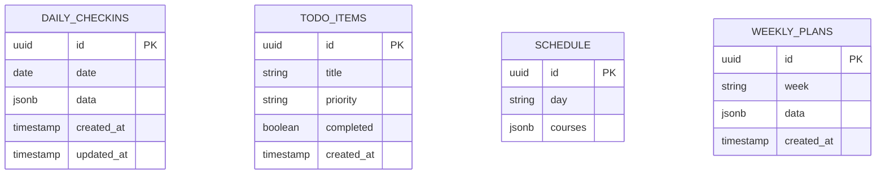

# 个人计划管理系统 - 技术架构文档
---

## 1. Architecture Design
```mermaid
graph TB
    A[Frontend - React] --&gt; B[State Management - Zustand]
    A --&gt; C[Supabase - Real-time Database]
    A --&gt; D[UI Components - TailwindCSS]
    A --&gt; E[Routing - React Router]
    C --&gt; F[PostgreSQL - Cloud Storage]
    C --&gt; G[Realtime Subscriptions]
```

---

## 2. Technology Description
- **Frontend**: React@18 + TypeScript + tailwindcss@3 + vite
- **Initialization Tool**: vite-init
- **Backend**: Supabase (云服务)
- **Database**: Supabase PostgreSQL + Realtime

**Supabase 配置**:
- Project URL: `https://ptizhibqkhkozakklzqh.supabase.co`
- Anon Key: `sb_publishable_mi9CaezrmOShaJUtLohOTw_ClnxATeT`

---

## 3. Route Definitions
| Route | Purpose | Navigation Label |
|-------|---------|-----------------|
| / | 首页/今日计划页 | 计划 |
| /checkin | 每日打卡页 | 打卡 |
| /todo | 待办事项页 | 待办 |
| /schedule | 课表页 | (隐藏) |
| /weekly | 周度计划页 | 周计划 |
| /stats | 数据统计页 | 统计 |

**注意**：
- 部署使用 GitHub Pages，`basename="/daily-planner"`
- 完整访问 URL: `https://mudrock-arknight.github.io/daily-planner/`

---

## 4. API Definitions
使用 Supabase 客户端 SDK 进行数据操作：

```typescript
import { createClient } from '@supabase/supabase-js'

const supabase = createClient(SUPABASE_URL, SUPABASE_ANON_KEY)

// 数据操作
const { data, error } = await supabase.from('daily_checkins').select('*')
const { data, error } = await supabase.from('daily_checkins').insert(...)
const { data, error } = await supabase.from('daily_checkins').update(...).eq('id', id)
const { data, error } = await supabase.from('daily_checkins').delete().eq('id', id)

// 实时订阅
supabase.channel('realtime_channel').on(
  'postgres_changes',
  { event: '*', schema: 'public' },
  (payload) =&gt; {
    console.log('数据变化:', payload)
  }
).subscribe()
```

---

## 5. Server Architecture Diagram
使用 Supabase 托管服务。

---

## 6. Data Model

### 6.1 Data Model Definition


### 6.2 数据结构定义
```typescript
// --------------- 实际使用的数据结构 ---------------

// 待办事项
interface TodoItem {
  id?: string;
  title: string;
  completed: boolean;
  created_at?: string;
}

// 时间块完成记录 (存储在 daily_checkins.data.completions 中)
interface CompletionRecord {
  planDate: string;      // ISO日期, e.g. "2026-06-02"
  timeblockIndex: number;
  completed: boolean;
  timestamp?: string;
}

// 每日打卡记录 (data 字段中包含 completions 数组)
interface DailyCheckin {
  id?: string;
  date: string;
  data: {
    sleepTime?: string;
    wakeTime?: string;
    energyScore?: number;
    moodScore?: number;
    phoneCheck?: any;
    importantTasks?: any[];
    studyTrack?: any;
    phoneMonitor?: any;
    healthStatus?: any;
    eveningReview?: any;
    tomorrowPlan?: any;
    scores?: any;
    // 新增：时间块完成记录
    completions?: CompletionRecord[];
  };
  created_at?: string;
  updated_at?: string;
}

interface Course {
  name: string;
  teacher: string;
  time: string;
  location: string;
  weeks: string;
}

// 周度计划 (实际存储在 weekly_plans.data 中)
interface WeeklyPlanData {
  startDate: string;      // ISO日期, e.g. "2026-06-02"
  endDate: string;        // ISO日期, e.g. "2026-06-08"
  goals: Array&lt;{
    id: string;
    text: string;
    progress: number;
    deadline?: string;
    type?: 'exam' | 'task' | 'study';
    totalHours?: number;
  }&gt;;
  dailySchedule: {
    [dayName: string]: {   // key: "周一" | "周二" | ... | "周日"
      date: string;        // 可能是 "6月2日" 或 ISO日期，建议使用 startDate 计算
      dayOfWeek?: string;
      theme?: string;
      themeColor?: 'blue' | 'red' | 'green' | 'orange' | 'purple' | 'teal' | 'pink';
      focusGoal?: string;
      englishTarget?: number;
      timeBlocks: Array&lt;{
        time: string;       // 格式 "HH:MM-HH:MM"
        content: string;
        location?: string;
        type: 'class' | 'study' | 'exam' | 'break' | 'task';
        detail?: string;
        countable?: boolean;
      }&gt;;
    };
  };
  longTermGoals?: any[];
  notes?: any[];
  weeklyReview?: any;
}

interface WeeklyPlan {
  id?: string;
  week: string;
  data: WeeklyPlanData;  // 所有数据都在这个 JSONB 字段里
  created_at?: string;
  updated_at?: string;
}

// --------------- 已废弃的数据结构 (保留仅参考) ---------------
// 旧版本的 WeeklyPlan，不再使用
interface OldWeeklyPlan {
  id?: string;
  week: string;
  startDate: string;
  endDate: string;
  goals: Array&lt;{ id: string; text: string; progress: number; }&gt;;
  dailySchedule: Record&lt;string, string&gt;;
  timeBlocks: {
    morning?: { start: string; end: string };
    afternoon?: { start: string; end: string };
    evening?: { start: string; end: string };
  };
  created_at?: string;
}
```

### 6.3 数据存储方式说明

**重要**: 大多数业务数据存储在 `JSONB` 类型的 `data` 字段中，而非表的独立列。

- `daily_checkins.data`: 存放打卡详情 + 时间块完成记录 `completions`
- `weekly_plans.data`: 存放完整的周计划内容 (goals, dailySchedule 等)

**时间块自动完成逻辑** (HomePage.tsx / WeeklyPlanPage.tsx):
- `class` / `exam` / `break` / `task`: 日期 < 今天 或 (日期 == 今天 且 时间已过) → 自动完成
- `study`: 需用户手动点击完成，不计入自动完成

**日期计算修正** (针对数据库日期可能有误的情况):
- 使用 `weeklyPlan.data.startDate` 作为基准
- 根据 `dayName` (周一/周二...) 推算正确的 ISO 日期 (startDate + n 天)
- 而不是直接使用 `dailySchedule[dayName].date` 字段

### 6.4 DDL 数据库表创建语句
```sql
-- 创建每日打卡表
CREATE TABLE daily_checkins (
    id UUID DEFAULT gen_random_uuid() PRIMARY KEY,
    date DATE NOT NULL UNIQUE,
    data JSONB NOT NULL,
    created_at TIMESTAMP WITH TIME ZONE DEFAULT NOW(),
    updated_at TIMESTAMP WITH TIME ZONE DEFAULT NOW()
);

-- 创建待办事项表 (注：实际没有 priority 字段)
CREATE TABLE todo_items (
    id UUID DEFAULT gen_random_uuid() PRIMARY KEY,
    title TEXT NOT NULL,
    completed BOOLEAN DEFAULT FALSE,
    created_at TIMESTAMP WITH TIME ZONE DEFAULT NOW(),
    updated_at TIMESTAMP WITH TIME ZONE DEFAULT NOW()
);

-- 创建课表
CREATE TABLE schedule (
    id UUID DEFAULT gen_random_uuid() PRIMARY KEY,
    day TEXT NOT NULL UNIQUE,
    courses JSONB NOT NULL,
    created_at TIMESTAMP WITH TIME ZONE DEFAULT NOW(),
    updated_at TIMESTAMP WITH TIME ZONE DEFAULT NOW()
);

-- 创建周度计划表
CREATE TABLE weekly_plans (
    id UUID DEFAULT gen_random_uuid() PRIMARY KEY,
    week TEXT NOT NULL UNIQUE,
    data JSONB NOT NULL,
    created_at TIMESTAMP WITH TIME ZONE DEFAULT NOW(),
    updated_at TIMESTAMP WITH TIME ZONE DEFAULT NOW()
);

-- 注：没有单独的 timeblock_completions 表
-- 时间块完成记录存储在 daily_checkins.data.completions 数组中
```

-- 启用行级安全 (RLS)
ALTER TABLE daily_checkins ENABLE ROW LEVEL SECURITY;
ALTER TABLE todo_items ENABLE ROW LEVEL SECURITY;
ALTER TABLE schedule ENABLE ROW LEVEL SECURITY;
ALTER TABLE weekly_plans ENABLE ROW LEVEL SECURITY;

-- 允许公开访问 (个人使用，简化权限)
CREATE POLICY "Public Access" ON daily_checkins FOR ALL USING (true);
CREATE POLICY "Public Access" ON todo_items FOR ALL USING (true);
CREATE POLICY "Public Access" ON schedule FOR ALL USING (true);
CREATE POLICY "Public Access" ON weekly_plans FOR ALL USING (true);

-- 授予权限
GRANT ALL PRIVILEGES ON TABLE daily_checkins TO anon;
GRANT ALL PRIVILEGES ON TABLE todo_items TO anon;
GRANT ALL PRIVILEGES ON TABLE schedule TO anon;
GRANT ALL PRIVILEGES ON TABLE weekly_plans TO anon;

-- 创建更新时间触发器
CREATE OR REPLACE FUNCTION update_updated_at_column()
RETURNS TRIGGER AS $$
BEGIN
   NEW.updated_at = NOW();
   RETURN NEW;
END;
$$ language 'plpgsql';

CREATE TRIGGER update_daily_checkins_updated_at BEFORE UPDATE ON daily_checkins
    FOR EACH ROW EXECUTE FUNCTION update_updated_at_column();

CREATE TRIGGER update_todo_items_updated_at BEFORE UPDATE ON todo_items
    FOR EACH ROW EXECUTE FUNCTION update_updated_at_column();

CREATE TRIGGER update_schedule_updated_at BEFORE UPDATE ON schedule
    FOR EACH ROW EXECUTE FUNCTION update_updated_at_column();

CREATE TRIGGER update_weekly_plans_updated_at BEFORE UPDATE ON weekly_plans
    FOR EACH ROW EXECUTE FUNCTION update_updated_at_column();
```
