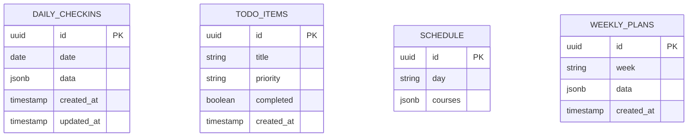

# 个人计划管理系统 - 技术架构文档
---

## 1. Architecture Design
```mermaid
graph TB
    A[Frontend - React] --&gt; B[State Management - Zustand]
    A --&gt; C[Supabase - Real-time Database]
    A --&gt; D[UI Components - TailwindCSS]
    A --&gt; E[Routing - React Router]
    C --&gt; F[PostgreSQL - Cloud Storage]
    C --&gt; G[Realtime Subscriptions]
```

---

## 2. Technology Description
- **Frontend**: React@18 + TypeScript + tailwindcss@3 + vite
- **Initialization Tool**: vite-init
- **Backend**: Supabase (云服务)
- **Database**: Supabase PostgreSQL + Realtime

**Supabase 配置**:
- Project URL: `https://ptizhibqkhkozakklzqh.supabase.co`
- Anon Key: `sb_publishable_mi9CaezrmOShaJUtLohOTw_ClnxATeT`

---

## 3. Route Definitions
| Route | Purpose |
|-------|---------|
| / | 首页/导航页 |
| /checkin | 每日打卡页 |
| /todo | 待办事项页 |
| /schedule | 课表页 |
| /weekly | 周度计划页 |
| /stats | 数据统计页 |

---

## 4. API Definitions
使用 Supabase 客户端 SDK 进行数据操作：

```typescript
import { createClient } from '@supabase/supabase-js'

const supabase = createClient(SUPABASE_URL, SUPABASE_ANON_KEY)

// 数据操作
const { data, error } = await supabase.from('daily_checkins').select('*')
const { data, error } = await supabase.from('daily_checkins').insert(...)
const { data, error } = await supabase.from('daily_checkins').update(...).eq('id', id)
const { data, error } = await supabase.from('daily_checkins').delete().eq('id', id)

// 实时订阅
supabase.channel('realtime_channel').on(
  'postgres_changes',
  { event: '*', schema: 'public' },
  (payload) =&gt; {
    console.log('数据变化:', payload)
  }
).subscribe()
```

---

## 5. Server Architecture Diagram
使用 Supabase 托管服务。

---

## 6. Data Model

### 6.1 Data Model Definition


### 6.2 数据结构定义
```typescript
interface DailyCheckin {
  id?: string;
  date: string;
  sleepTime: string;
  wakeTime: string;
  energyScore: number;
  moodScore: number;
  phoneCheck: {
    noPhoneInBed: boolean;
    noPhoneFirst: boolean;
    noTikTok: boolean;
  };
  importantTasks: Array&lt;{
    id: string;
    text: string;
    status: 'todo' | 'done' | 'partial';
  }&gt;;
  studyTrack: {
    englishHours: number;
    wordCount?: number;
    readingCount?: number;
    listeningMinutes?: number;
    writingCount?: number;
    timeBlocks: Array&lt;{
      start: string;
      end: string;
      content: string;
    }&gt;;
  };
  phoneMonitor: {
    totalHours: number;
    tiktokHours: number;
    gameHours: number;
    isQualified: boolean;
    issues: string[];
  };
  healthStatus: {
    exercise: boolean;
    exerciseType?: string;
    exerciseMinutes?: number;
    meals: 'regular' | 'oneMissing' | 'unhealthy';
    waterEnough: boolean;
    skincare: boolean;
    teethCare: boolean;
  };
  eveningReview: {
    achievements: string[];
    improvements: string[];
    timeWaste: string;
    mindset: string;
    messageToSelf: string;
  };
  tomorrowPlan: {
    tasks: string[];
    wakeTime: string;
  };
  scores: {
    sleepScore: number;
    englishScore: number;
    phoneScore: number;
    tasksScore: number;
    moodScore: number;
    total: number;
  };
  created_at?: string;
  updated_at?: string;
}

interface TodoItem {
  id?: string;
  title: string;
  priority: 'high' | 'medium' | 'low';
  completed: boolean;
  created_at?: string;
}

interface Course {
  name: string;
  teacher: string;
  time: string;
  location: string;
  weeks: string;
}

interface WeeklyPlan {
  id?: string;
  week: string;
  startDate: string;
  endDate: string;
  goals: Array&lt;{
    id: string;
    text: string;
    progress: number;
  }&gt;;
  dailySchedule: Record&lt;string, string&gt;;
  timeBlocks: {
    morning?: { start: string; end: string };
    afternoon?: { start: string; end: string };
    evening?: { start: string; end: string };
  };
  created_at?: string;
}
```

### 6.3 DDL 数据库表创建语句
```sql
-- 创建每日打卡表
CREATE TABLE daily_checkins (
    id UUID DEFAULT gen_random_uuid() PRIMARY KEY,
    date DATE NOT NULL UNIQUE,
    data JSONB NOT NULL,
    created_at TIMESTAMP WITH TIME ZONE DEFAULT NOW(),
    updated_at TIMESTAMP WITH TIME ZONE DEFAULT NOW()
);

-- 创建待办事项表
CREATE TABLE todo_items (
    id UUID DEFAULT gen_random_uuid() PRIMARY KEY,
    title TEXT NOT NULL,
    priority TEXT NOT NULL CHECK (priority IN ('high', 'medium', 'low')),
    completed BOOLEAN DEFAULT FALSE,
    created_at TIMESTAMP WITH TIME ZONE DEFAULT NOW(),
    updated_at TIMESTAMP WITH TIME ZONE DEFAULT NOW()
);

-- 创建课表
CREATE TABLE schedule (
    id UUID DEFAULT gen_random_uuid() PRIMARY KEY,
    day TEXT NOT NULL UNIQUE,
    courses JSONB NOT NULL,
    created_at TIMESTAMP WITH TIME ZONE DEFAULT NOW(),
    updated_at TIMESTAMP WITH TIME ZONE DEFAULT NOW()
);

-- 创建周度计划表
CREATE TABLE weekly_plans (
    id UUID DEFAULT gen_random_uuid() PRIMARY KEY,
    week TEXT NOT NULL UNIQUE,
    data JSONB NOT NULL,
    created_at TIMESTAMP WITH TIME ZONE DEFAULT NOW(),
    updated_at TIMESTAMP WITH TIME ZONE DEFAULT NOW()
);

-- 启用行级安全 (RLS)
ALTER TABLE daily_checkins ENABLE ROW LEVEL SECURITY;
ALTER TABLE todo_items ENABLE ROW LEVEL SECURITY;
ALTER TABLE schedule ENABLE ROW LEVEL SECURITY;
ALTER TABLE weekly_plans ENABLE ROW LEVEL SECURITY;

-- 允许公开访问 (个人使用，简化权限)
CREATE POLICY "Public Access" ON daily_checkins FOR ALL USING (true);
CREATE POLICY "Public Access" ON todo_items FOR ALL USING (true);
CREATE POLICY "Public Access" ON schedule FOR ALL USING (true);
CREATE POLICY "Public Access" ON weekly_plans FOR ALL USING (true);

-- 授予权限
GRANT ALL PRIVILEGES ON TABLE daily_checkins TO anon;
GRANT ALL PRIVILEGES ON TABLE todo_items TO anon;
GRANT ALL PRIVILEGES ON TABLE schedule TO anon;
GRANT ALL PRIVILEGES ON TABLE weekly_plans TO anon;

-- 创建更新时间触发器
CREATE OR REPLACE FUNCTION update_updated_at_column()
RETURNS TRIGGER AS $$
BEGIN
   NEW.updated_at = NOW();
   RETURN NEW;
END;
$$ language 'plpgsql';

CREATE TRIGGER update_daily_checkins_updated_at BEFORE UPDATE ON daily_checkins
    FOR EACH ROW EXECUTE FUNCTION update_updated_at_column();

CREATE TRIGGER update_todo_items_updated_at BEFORE UPDATE ON todo_items
    FOR EACH ROW EXECUTE FUNCTION update_updated_at_column();

CREATE TRIGGER update_schedule_updated_at BEFORE UPDATE ON schedule
    FOR EACH ROW EXECUTE FUNCTION update_updated_at_column();

CREATE TRIGGER update_weekly_plans_updated_at BEFORE UPDATE ON weekly_plans
    FOR EACH ROW EXECUTE FUNCTION update_updated_at_column();
```
