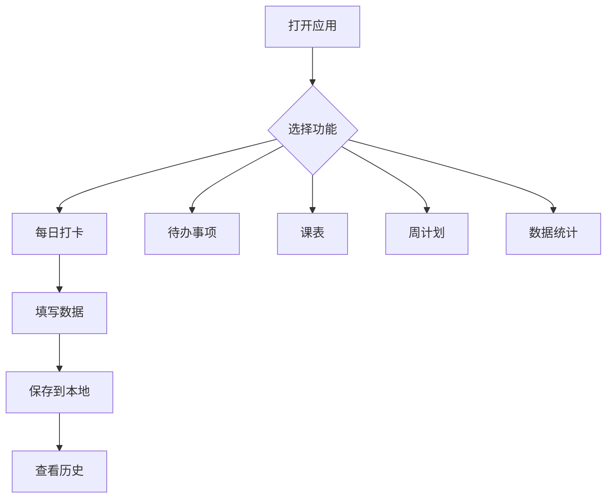

# 个人计划管理系统
---

## 1. Product Overview
一个专为个人日常管理设计的计划管理应用，整合打卡系统、待办事项、课表显示、计划管理于一体。目标用户为大学生，解决手动填写txt文件效率低的问题，提供美观、便捷的数字化管理体验。

---

## 2. Core Features

### 2.1 User Roles
| Role | Registration Method | Core Permissions |
|------|---------------------|------------------|
| 个人用户 | 本地存储，无需注册 | 使用所有功能，数据本地保存 |

### 2.2 Feature Module
1. **每日打卡页**：早起检查、三件要事、学习追踪、手机监控、身体状态、晚间复盘
2. **待办事项页**：任务添加、完成标记、优先级管理
3. **课表页**：周课表显示、课程详情
4. **周度计划页**：周计划制定、进度追踪
5. **数据统计页**：打卡完成率、学习时长统计

### 2.3 Page Details
| Page Name | Module Name | Feature description |
|-----------|-------------|---------------------|
| 每日打卡页 | 早起检查 | 记录入睡/起床时间、手机检查、状态评分 |
| 每日打卡页 | 三件要事 | 添加/编辑今日最重要的3件事，标记完成状态 |
| 每日打卡页 | 学习追踪 | 记录英语学习时长、具体内容、时间块记录 |
| 每日打卡页 | 手机监控 | 屏幕使用时间、失控原因记录 |
| 每日打卡页 | 身体状态 | 运动、三餐、喝水、护肤、刷牙记录 |
| 每日打卡页 | 晚间复盘 | 成就、不足、时间浪费、心态记录、明日计划 |
| 待办事项页 | 任务管理 | 添加待办、设置优先级、标记完成 |
| 课表页 | 周课表 | 显示本周课程安排、时间、地点 |
| 周度计划页 | 周计划 | 制定下周目标、预分配时间块 |
| 数据统计页 | 统计展示 | 打卡完成率、学习时长、作息统计 |

---

## 3. Core Process
用户打开应用 → 选择功能页面 → 填写/查看数据 → 数据自动本地保存 → 查看历史数据

---

## 4. User Interface Design
### 4.1 Design Style
- **主色调**：清新的蓝色系 (#3B82F6)，搭配温暖的橙色 (#F59E0B) 作为强调色
- **按钮风格**：圆角矩形，有轻微阴影，点击有反馈动画
- **字体**：使用现代无衬线字体，清晰易读
- **布局风格**：卡片式布局，清晰的信息层级
- **图标风格**：简洁的线性图标，配合 emoji 增强视觉表达

### 4.2 Page Design Overview
| Page Name | Module Name | UI Elements |
|-----------|-------------|-------------|
| 每日打卡页 | 表单卡片 | 分组卡片，每个功能模块一个卡片，渐变色背景，清晰的图标标题 |
| 待办事项页 | 任务列表 | 卡片式任务，可滑动或点击完成，优先级颜色标记 |
| 课表页 | 课表网格 | 彩色网格，课程块有颜色区分，悬停显示详情 |
| 周度计划页 | 时间轴布局 | 垂直时间轴，显示每天的计划安排 |
| 数据统计页 | 图表展示 | 简洁的进度条、统计卡片，数据可视化 |

### 4.3 Responsiveness
- **移动优先**：主要为手机端设计，同时完美适配桌面端
- **触摸优化**：按钮和可点击元素足够大，方便触摸操作
- **响应式布局**：在不同屏幕尺寸下自动调整布局

### 4.4 3D Scene Guidance
- 不使用3D场景
