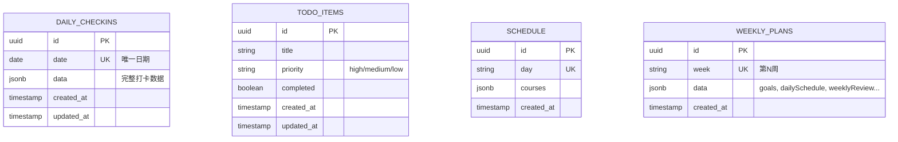

# 个人计划管理系统 - Code Wiki

> **项目名称**: Daily Planner (daily-planner)
> **版本**: 0.0.0
> **技术栈**: React 18 + TypeScript + Vite + Tailwind CSS + Zustand + Supabase
> **部署**: GitHub Pages
> **目标用户**: 大学生及需要个人时间管理的用户

---

## 目录

1. [项目概述](#1-项目概述)
2. [技术栈与依赖](#2-技术栈与依赖)
3. [项目整体架构](#3-项目整体架构)
4. [目录结构说明](#4-目录结构说明)
5. [核心模块详解](#5-核心模块详解)
6. [数据模型与数据库](#6-数据模型与数据库)
7. [状态管理](#7-状态管理)
8. [路由配置](#8-路由配置)
9. [UI/UX 设计体系](#9-uiux-设计体系)
10. [关键工具脚本](#10-关键工具脚本)
11. [部署与 CI/CD](#11-部署与-cicd)
12. [运行与开发指南](#12-运行与开发指南)
13. [开发规范与约定](#13-开发规范与约定)

---

## 1. 项目概述

### 1.1 项目定位

一个面向**大学生**的个人日常管理应用，整合了**打卡系统、待办事项、课表显示、计划管理**和**数据统计**等功能。解决了用户"时间被手机吸引、学习断断续续、缺少干劲"的痛点。

### 1.2 核心特性

| 模块 | 核心能力 |
|------|---------|
| 首页 (Home) | 实时显示当前时间块、每日计划、待办、本周目标、长期目标 |
| 打卡 (Checkin) | 每日作息记录、心情评分、学习时长、健康打卡 |
| 待办 (Todo) | 任务添加、完成标记、删除、优先级、完成率统计 |
| 课表 (Schedule) | 第13周课程表展示、课程详情、颜色区分 |
| 周计划 (Weekly) | 本周目标、每日时间块、英语目标进度、复盘 |
| 统计 (Stats) | 连续打卡、学习趋势、六级倒计时、完成率统计 |

### 1.3 业务流程

```
打开应用 → 底部导航选择功能 → 数据加载自 Supabase
   ↓
用户操作(打卡/添加待办/切换日) → 实时写入数据库
   ↓
统计页聚合分析 → 展示学习趋势与完成率
```

---

## 2. 技术栈与依赖

### 2.1 核心依赖 ([package.json](file:///e:/szx/大学生活/daily/package.json))

| 依赖 | 版本 | 用途 |
|------|------|------|
| **react** | ^18.3.1 | 前端 UI 框架 |
| **react-dom** | ^18.3.1 | React DOM 渲染 |
| **react-router-dom** | ^6.23.1 | 客户端路由 |
| **zustand** | ^4.5.2 | 轻量级状态管理 |
| **@supabase/supabase-js** | ^2.43.4 | Supabase 客户端 SDK |
| **lucide-react** | ^0.383.0 | 图标库 |
| **pg** | ^8.21.0 | Node.js PostgreSQL 客户端 (用于脚本) |

### 2.2 开发依赖

| 工具 | 用途 |
|------|------|
| **vite** ^5.2.11 | 构建工具与开发服务器 |
| **typescript** ^5.2.2 | 类型系统 |
| **tailwindcss** ^3.4.3 | 原子化 CSS 框架 |
| **@vitejs/plugin-react** | Vite 的 React 插件 |
| **postcss** / **autoprefixer** | CSS 后处理 |
| **eslint** | 代码检查 |
| **@typescript-eslint/*** | TypeScript 规则集 |

### 2.3 关键 npm 脚本

```bash
npm run dev      # 启动 Vite 开发服务器 (默认 5173 端口)
npm run build    # TypeScript 编译 + 生产构建
npm run lint     # ESLint 检查 (--max-warnings 0)
npm run preview  # 预览构建产物
```

---

## 3. 项目整体架构

### 3.1 架构图

```
┌─────────────────────────────────────────────────┐
│           Browser (GitHub Pages)                │
│  ┌──────────────────────────────────────────┐   │
│  │   React 18 SPA (TypeScript)              │   │
│  │  ┌──────────┐  ┌──────────┐  ┌────────┐  │   │
│  │  │  Pages   │←→│  Store   │←→│  Lib   │  │   │
│  │  │ (Views)  │  │ (Zustand)│  │(Supa)  │  │   │
│  │  └──────────┘  └──────────┘  └────┬───┘  │   │
│  │       ↑                  ↑        ↓      │   │
│  │       └──── React Router ─┘  Supabase JS  │   │
│  └─────────────────────────────────┬────────┘   │
└────────────────────────────────────┼────────────┘
                                     │ HTTPS
                                     ↓
                    ┌────────────────────────────────┐
                    │  Supabase (BaaS)               │
                    │  ┌──────────────┐              │
                    │  │ PostgreSQL   │  Realtime    │
                    │  │  + RLS       │  Subscriptions│
                    │  └──────────────┘              │
                    └────────────────────────────────┘
```

### 3.2 架构模式

- **前端**: 单页应用 (SPA)，组件化、路由驱动
- **后端**: Supabase 提供 BaaS (Backend as a Service)
- **数据流**: 组件 → Zustand Store → Supabase Client → PostgreSQL
- **实时性**: 通过 Supabase 的 `postgres_changes` 频道订阅数据变化
- **样式**: Tailwind CSS + 自定义动画 + 渐变色设计语言

### 3.3 应用入口链

```
[index.html](file:///e:/szx/大学生活/daily/index.html)
  → [src/main.tsx](file:///e:/szx/大学生活/daily/src/main.tsx) (React 根挂载)
    → [src/App.tsx](file:///e:/szx/大学生活/daily/src/App.tsx) (路由 + 导航栏)
      → 6 个页面组件 ([src/pages/](file:///e:/szx/大学生活/daily/src/pages))
```

---

## 4. 目录结构说明

```
daily/
├── .github/workflows/
│   └── deploy.yml                  # GitHub Actions 自动部署
├── .trae/                          # 项目内部文档与规划
│   ├── documents/
│   │   ├── arch.md                 # 架构文档
│   │   └── prd.md                  # 产品需求文档
│   └── specs/                      # 功能规格
│       ├── personal-planner/       # 个人规划器规格
│       ├── plan-improvements/      # 计划改进
│       └── timeblock-completion/   # 时间块完成
├── src/
│   ├── lib/
│   │   ├── supabase.ts             # Supabase 公开客户端
│   │   └── supabase-admin.ts       # Supabase 服务端客户端
│   ├── pages/                      # 页面组件
│   │   ├── HomePage.tsx            # 首页
│   │   ├── CheckinPage.tsx         # 每日打卡
│   │   ├── TodoPage.tsx            # 待办事项
│   │   ├── SchedulePage.tsx        # 课表
│   │   ├── WeeklyPlanPage.tsx      # 周计划
│   │   └── StatsPage.tsx           # 数据统计
│   ├── store/
│   │   └── useStore.ts             # Zustand 全局状态
│   ├── types/
│   │   └── index.ts                # TypeScript 类型定义
│   ├── App.tsx                     # 路由与导航
│   ├── index.css                   # 全局样式 + 动画
│   └── main.tsx                    # 应用入口
├── supabase/
│   └── migrations/
│       └── 001_create_tables.sql   # 数据库初始化
├── add-*.mjs / *.mjs / *.js         # 数据库维护脚本
├── index.html                      # HTML 模板
├── package.json
├── vite.config.ts                  # Vite 配置 (base: /daily-planner/)
├── tailwind.config.js
├── tsconfig.json
└── postcss.config.js
```

---

## 5. 核心模块详解

### 5.1 应用入口与路由

#### [src/main.tsx](file:///e:/szx/大学生活/daily/src/main.tsx)
- 使用 `ReactDOM.createRoot` 挂载应用
- 包裹 `React.StrictMode` 以检测副作用问题

#### [src/App.tsx](file:///e:/szx/大学生活/daily/src/App.tsx)
- 配置 `BrowserRouter` (注意: base 路径为 `/daily-planner/`)
- 内部 `Navbar` 组件: 固定底部 Tab 导航 (5 个主入口 + 1 个未在导航中的 `/schedule`)
- 路由表 (Routes):

| 路径 | 组件 | 标签 |
|------|------|------|
| `/` | [HomePage](file:///e:/szx/大学生活/daily/src/pages/HomePage.tsx) | 计划 |
| `/checkin` | [CheckinPage](file:///e:/szx/大学生活/daily/src/pages/CheckinPage.tsx) | 打卡 |
| `/todo` | [TodoPage](file:///e:/szx/大学生活/daily/src/pages/TodoPage.tsx) | 待办 |
| `/schedule` | [SchedulePage](file:///e:/szx/大学生活/daily/src/pages/SchedulePage.tsx) | (无标签) |
| `/weekly` | [WeeklyPlanPage](file:///e:/szx/大学生活/daily/src/pages/WeeklyPlanPage.tsx) | 周计划 |
| `/stats` | [StatsPage](file:///e:/szx/大学生活/daily/src/pages/StatsPage.tsx) | 统计 |

### 5.2 首页 (HomePage)

**文件**: [src/pages/HomePage.tsx](file:///e:/szx/大学生活/daily/src/pages/HomePage.tsx)

**主要功能**:
1. 加载最新的周计划与最近 30 天的打卡完成记录
2. 根据当前时间自动判断**当前时间段** (清晨/上午/午间/下午/晚间/深夜)
3. 展示**当日时间块 (TimeBlock)**: 支持点击勾选完成
4. 显示**待办事项** (最多 3 项未完成)
5. 展示**本周目标** (前 4 个) 与**长期目标**

**关键函数**:
- `loadWeeklyPlan()`: 从 `weekly_plans` 拉取最新一周计划
- `loadCompletions()`: 聚合最近 30 天的 `data.completions` 字段
- `handleToggleCompletion()`: 切换时间块完成状态 (读写 `daily_checkins.data.completions`)
- `updateCurrentTask()`: 60 秒轮询当前时间段
- `isBlockCompleted()` / `isTimeBlockPast()`: 状态判断
- `themeColors` / `typeLabels`: 静态主题与类型映射

**本地接口**:
```typescript
interface TimeBlock {
  time: string         // "08:30-09:15"
  content: string      // 任务内容
  detail?: string      // 详情
  location?: string    // 地点
  type: string         // class/study/exam/break/task
  completed?: boolean
  completedAt?: string
}
```

### 5.3 每日打卡 (CheckinPage)

**文件**: [src/pages/CheckinPage.tsx](file:///e:/szx/大学生活/daily/src/pages/CheckinPage.tsx)

**功能模块**:
- 作息记录: 入睡时间 + 起床时间
- 心情评分: 5 星交互式评分
- 学习时长: 0-24 小时数字输入
- 健康打卡: 运动、喝水两个复选项

**关键逻辑**:
- 通过 `date = todayStr` (`YYYY-MM-DD`) 加载/创建当天记录
- `loadTodayCheckin()`: 查询 `daily_checkins` 中 `date = today` 的记录
- `handleSave()`: 存在则 `update`，否则 `insert`

**数据存储**:
- 表: `daily_checkins`
- 字段: `date` + `data` (JSONB)
- `data` 包含 `sleepTime`, `wakeTime`, `moodScore`, `studyHours`, `exercised`, `waterEnough`

### 5.4 待办事项 (TodoPage)

**文件**: [src/pages/TodoPage.tsx](file:///e:/szx/大学生活/daily/src/pages/TodoPage.tsx)

**核心机制**:
- 状态来自 Zustand (`useStore`)，但**直接同步到 Supabase**
- 通过 Supabase Realtime 订阅 `todo_items` 表的 `postgres_changes`，任何变化自动重载
- 排序: 先按 `completed` 升序，再按 `created_at` 降序

**关键函数**:
- `loadTodos()`: 拉取并写入 Store
- `handleAddTodo(e)`: 提交后 `insert` + 本地 `addTodo`
- `toggleTodo(id, completed)`: `update` 切换状态
- `handleDeleteTodo(id)`: `delete` + 本地 `deleteTodo`

**统计**:
- 未完成数 / 已完成数 / 完成率 (%)

### 5.5 课表 (SchedulePage)

**文件**: [src/pages/SchedulePage.tsx](file:///e:/szx/大学生活/daily/src/pages/SchedulePage.tsx)

**特点**:
- **静态数据展示** (无 Supabase 交互)
- 8 节 × 7 天 的二维数组 `scheduleData`
- 颜色按课程名映射 (`courseColors`)，支持 5 门课程
- 显示第 13 周课程表 (硬编码)

**课程数据**:
| 课程 | 教师 |
|------|------|
| 概率论与数理统计 | 李博文 |
| 智能汽车平台技术 | 曾子铭 |
| 工程力学一 | 赵升升 |
| 智能汽车环境感知技术 | 林艳艳 |
| 大学体育（4）（排球） | 郑军 |

### 5.6 周计划 (WeeklyPlanPage)

**文件**: [src/pages/WeeklyPlanPage.tsx](file:///e:/szx/大学生活/daily/src/pages/WeeklyPlanPage.tsx)

**核心展示**:
- 顶部 Hero: 周次 + 英语目标进度 (currentHours / targetHours)
- **本周目标卡片**: 含进度条、类型标签 (exam/study)、截止日期
- **每日概览**: 7 天网格卡片
- **选中日详情**: 主题头部 + 完整时间块列表
- **重要提醒** (notes)
- **周复盘**: 上周总结 / 本周重点 / 下周计划

**交互特性**:
- 完成状态可在该页直接 toggle (写入 `daily_checkins.data.completions`)
- 支持加载/错误/空态三态渲染
- 加载与错误态均有重试机制

### 5.7 数据统计 (StatsPage)

**文件**: [src/pages/StatsPage.tsx](file:///e:/szx/大学生活/daily/src/pages/StatsPage.tsx)

**统计维度**:

| 指标 | 计算方式 |
|------|---------|
| 连续打卡天数 | `calculateStreak()` 检查日期是否连续 |
| 累计打卡天数 | `daily_checkins` 记录数 |
| 总学习时长 | 累加 `data.studyHours` |
| 本周/上周对比 | 最近 7 天 vs 8-14 天前 |
| 时间块完成率 | `completed/total` |
| 各类型完成率 | 按 `timeblockType` 分组 |
| 英语目标进度 | `totalStudyHours / targetHours` |
| 六级倒计时 | 距 2025-06-14 的天数 |

**关键函数**:
- `calculateStreak(dates)`: 计算连续打卡 (从今天/昨天向前推)
- `getDaysUntilCET6()`: 硬编码六级日期

---

## 6. 数据模型与数据库

### 6.1 数据库 ER 图



### 6.2 表结构 (来自 [001_create_tables.sql](file:///e:/szx/大学生活/daily/supabase/migrations/001_create_tables.sql))

#### `daily_checkins` 每日打卡表
- 主键: `id UUID`
- 唯一约束: `date`
- 主体: `data JSONB` (灵活存储所有打卡内容)

#### `todo_items` 待办表
- `priority` 受 `CHECK` 约束: `high | medium | low`
- 软排序: `completed` + `created_at`

#### `schedule` 课表
- 按 day 存储课程 JSON

#### `weekly_plans` 周计划
- 唯一约束: `week` 字段
- `data` 包含 `goals`, `dailySchedule`, `timeBlocks`, `weeklyReview`, `longTermGoals`, `notes` 等

### 6.3 类型定义 ([src/types/index.ts](file:///e:/szx/大学生活/daily/src/types/index.ts))

**核心接口**:
- `TodoItem`: id, title, completed, created_at
- `DailyCheckin`: 完整打卡数据结构 (含 phoneCheck, studyTrack, phoneMonitor, healthStatus, eveningReview, tomorrowPlan, scores)
- `WeeklyPlan`: week, startDate, endDate, goals, dailySchedule, timeBlocks
- `ImportantTask`, `TimeBlock`, `StudyTrack`, `PhoneMonitor`, `HealthStatus`, `EveningReview`, `TomorrowPlan`, `Scores`, `WeeklyGoal`, `Course`

### 6.4 安全策略 (RLS)

所有表启用**行级安全 (Row Level Security)**, 但策略为 `Public Access USING (true)` —— 简化为**公开可读写** (个人使用, 无认证)。`anon` 角色被授予所有权限。

### 6.5 触发器

`update_updated_at_column()` 触发器在所有表 `BEFORE UPDATE` 时自动刷新 `updated_at`。

---

## 7. 状态管理

### Zustand Store

**文件**: [src/store/useStore.ts](file:///e:/szx/大学生活/daily/src/store/useStore.ts)

**结构**:
```typescript
interface AppState {
  todos: TodoItem[]
  dailyCheckins: DailyCheckin[]
  weeklyPlans: WeeklyPlan[]
  
  // Todos
  setTodos / addTodo / updateTodo / deleteTodo
  
  // Daily Checkins
  setDailyCheckins / addDailyCheckin / updateDailyCheckin
  
  // Weekly Plans
  setWeeklyPlans / addWeeklyPlan
}
```

**使用模式**:
- 大多数页面组件**直接调用 Supabase** 而非先 dispatch 到 store
- Store 当前主要在 [TodoPage](file:///e:/szx/大学生活/daily/src/pages/TodoPage.tsx) 和 [HomePage](file:///e:/szx/大学生活/daily/src/pages/HomePage.tsx) 中作为本地缓存使用

---

## 8. 路由配置

| 路径 | 组件 | 在底部导航 |
|------|------|-----------|
| `/` | HomePage | ✅ 计划 |
| `/checkin` | CheckinPage | ✅ 打卡 |
| `/todo` | TodoPage | ✅ 待办 |
| `/schedule` | SchedulePage | ❌ (代码可访问) |
| `/weekly` | WeeklyPlanPage | ✅ 周计划 |
| `/stats` | StatsPage | ✅ 统计 |

注意 `/schedule` 在 App.tsx 中注册了路由，但**未在 Navbar 中显示入口**。

---

## 9. UI/UX 设计体系

### 9.1 色彩系统 ([index.css](file:///e:/szx/大学生活/daily/src/index.css))

**主题色**:
- Primary: `#6366f1` (Indigo-500)
- Accent: `#ec4899` (Pink-500)
- Success: `#10b981` (Emerald-500)
- Warning: `#f59e0b` (Amber-500)

**背景**:
- 全局: `linear-gradient(135deg, #667eea 0%, #764ba2 50%, #f093fb 100%)`
- 移动端: 微调渐变角度

**主题色映射 (themeColors)** (在 HomePage/WeeklyPlanPage 中):
- blue, red, green, orange, purple, teal, pink
- 每个含 6 个变体: bg, text, border, gradient, light, dark

### 9.2 动画与微交互

通过 CSS `@keyframes` 与自定义类实现:
- `animate-float` (浮动)
- `animate-fadeIn` (淡入)
- `animate-fadeInUp`, `animate-slideInLeft/Right`
- `animate-pulse`, `animate-pulse-slow`
- `animate-scaleIn`, `animate-bounce-subtle`
- `card-hover`, `btn-hover`, `icon-bounce`
- `progress-bar` (1.5s 缓动)
- `bg-decorations` + 3 个浮动装饰球体
- `.stagger-1` ~ `.stagger-5` 错位动画延迟

### 9.3 字体

- 中文: `Noto Sans SC` (300/400/500/600/700)
- 英文: `Space Grotesk` (400/500/600/700)
- 备用: `system-ui, -apple-system, BlinkMacSystemFont, 'Segoe UI'`

### 9.4 布局模式

- **移动优先**: `max-w-2xl mx-auto` / `max-w-4xl mx-auto`
- **底部固定导航栏**: `fixed bottom-0 ... z-50`, 内容预留 `pb-20`
- **卡片化**: `rounded-3xl shadow-xl p-6`
- **玻璃拟态**: `.glass-morphism`, `.glass-morphism-card`

---

## 10. 关键工具脚本

项目根目录有多个 Node.js 脚本用于**直接操作 Supabase 数据库** (绕过 RLS, 使用 service_role key):

| 脚本 | 用途 |
|------|------|
| [add-todo.js](file:///e:/szx/大学生活/daily/add-todo.js) | 添加待办 |
| [add-data.mjs](file:///e:/szx/大学生活/daily/add-data.mjs) | 通用数据添加 |
| [add-plan.mjs](file:///e:/szx/大学生活/daily/add-plan.mjs) | 添加周计划 |
| [add-weekly.mjs](file:///e:/szx/大学生活/daily/add-weekly.mjs) | 添加周计划数据 |
| [add-columns.mjs](file:///e:/szx/大学生活/daily/add-columns.mjs) | 添加列 |
| [add-columns-rpc.mjs](file:///e:/szx/大学生活/daily/add-columns-rpc.mjs) | 通过 RPC 添加列 |
| [update-weekly-plan.mjs](file:///e:/szx/大学生活/daily/update-weekly-plan.mjs) | 更新周计划 |
| [update-detailed-plan.mjs](file:///e:/szx/大学生活/daily/update-detailed-plan.mjs) | 更新详细计划 |
| [generate-plan.js](file:///e:/szx/大学生活/daily/generate-plan.js) | 生成计划 |
| [check-schema.mjs](file:///e:/szx/大学生活/daily/check-schema.mjs) | 检查 schema |
| [check-columns.mjs](file:///e:/szx/大学生活/daily/check-columns.mjs) | 检查列 |
| [check-schema-sql.mjs](file:///e:/szx/大学生活/daily/check-schema-sql.mjs) | SQL 检查 schema |
| [check-table.mjs](file:///e:/szx/大学生活/daily/check-table.mjs) | 检查表 |
| [query-columns.mjs](file:///e:/szx/大学生活/daily/query-columns.mjs) | 查询列 |
| [fetch-schema.mjs](file:///e:/szx/大学生活/daily/fetch-schema.mjs) | 拉取 schema |
| [test-supabase.js](file:///e:/szx/大学生活/daily/test-supabase.js) | 连接测试 |
| [test-supabase.mjs](file:///e:/szx/大学生活/daily/test-supabase.mjs) | 连接测试 |
| [test-insert.mjs](file:///e:/szx/大学生活/daily/test-insert.mjs) | 插入测试 |
| [cli.js](file:///e:/szx/大学生活/daily/cli.js) | CLI 工具 |

**典型用途**: 通过 npm 直接 `node add-plan.mjs` 来在终端操作数据库，便于 AI 代理脚本化管理数据 (符合 PRD 中 "AI直接操作数据库" 的 AC-5)。

---

## 11. 部署与 CI/CD

### 11.1 GitHub Actions 工作流

**文件**: [.github/workflows/deploy.yml](file:///e:/szx/大学生活/daily/.github/workflows/deploy.yml)

**触发条件**: 推送到 `main` 分支

**流程**:
1. `actions/checkout@v4` 拉取代码
2. `actions/setup-node@v4` 配置 Node 20 + npm 缓存
3. `npm ci` 安装依赖
4. 清理 `dist` 与 `.vite` 缓存
5. `npm run build` 构建
6. `actions/configure-pages@v4` 配置 Pages
7. `actions/upload-pages-artifact@v3` 上传 `dist`
8. `actions/deploy-pages@v4` 部署到 GitHub Pages

**权限**:
- `contents: read`
- `pages: write`
- `id-token: write` (用于 OIDC 部署)

**并发控制**: `pages` 组, 自动取消进行中任务

### 11.2 Vite 配置 ([vite.config.ts](file:///e:/szx/大学生活/daily/vite.config.ts))

```typescript
{
  plugins: [react()],
  base: '/daily-planner/',  // ⚠️ GitHub Pages 子路径
  build: { assetsDir: 'assets' },
  server: { host: '0.0.0.0', port: 5173 }
}
```

**重要**: `base` 字段必须与 GitHub Pages 仓库名一致, 否则资源路径会出错。

### 11.3 TypeScript 配置 ([tsconfig.json](file:///e:/szx/大学生活/daily/tsconfig.json))

- `target: ES2020`
- `moduleResolution: bundler`
- `strict: true` (严格模式)
- `noUnusedLocals: true` / `noUnusedParameters: true`
- `jsx: react-jsx` (新版 JSX 转换)
- `noEmit: true` (由 Vite 负责输出)
- `include: ["src"]`

---

## 12. 运行与开发指南

### 12.1 环境准备

- Node.js >= 18 (推荐 20)
- npm 或 pnpm
- Supabase 账户 (项目已配置远端)

### 12.2 本地开发

```bash
# 1. 安装依赖
npm install

# 2. 启动开发服务器 (默认 http://localhost:5173)
npm run dev

# 3. 类型检查 + 生产构建
npm run build

# 4. 预览构建产物
npm run preview

# 5. 代码检查
npm run lint
```

### 12.3 数据库初始化

将 [001_create_tables.sql](file:///e:/szx/大学生活/daily/supabase/migrations/001_create_tables.sql) 在 Supabase SQL Editor 中执行即可创建所有表、RLS 策略与触发器。

### 12.4 环境变量 (现状)

⚠️ **注意**: 当前 Supabase 的 `URL` 和 `ANON_KEY` / `SERVICE_KEY` 是**硬编码**在 [supabase.ts](file:///e:/szx/大学生活/daily/src/lib/supabase.ts) 和 [supabase-admin.ts](file:///e:/szx/大学生活/daily/src/lib/supabase-admin.ts) 中的。生产实践建议改为 `.env` + `import.meta.env` 方式。

### 12.5 部署流程

1. 提交代码到 `main` 分支
2. GitHub Actions 自动触发
3. 构建完成后自动部署到 GitHub Pages
4. 访问 URL: `https://<username>.github.io/daily-planner/`

---

## 13. 开发规范与约定

### 13.1 文件命名

- 页面组件: `PascalCase.tsx` (例: `HomePage.tsx`)
- 工具/库: `camelCase.ts` (例: `supabase.ts`, `useStore.ts`)
- 类型: 统一在 `src/types/index.ts` 集中导出
- 脚本: `.mjs` 优先 (ES Modules)

### 13.2 组件模式

- **页面组件**: 默认导出 (便于 React Router lazy load)
- **页面内部子组件**: 函数声明, 不导出
- **Hooks 使用**: `useState`, `useEffect`, `useCallback` 为主
- **类型注解**: 严格 TypeScript, 优先 `interface` 而非 `type`

### 13.3 数据获取

- **优先**: 直接 `supabase.from(...)` 调用
- **缓存**: 视情况使用 Zustand (主要在 Todo 与 Home)
- **错误处理**: 大多用 `console.error`, 部分有 `try/catch` + 错误状态
- **加载状态**: `useState` 中的 `loading` 布尔, 通过条件渲染 Loading UI

### 13.4 样式约定

- **首选**: Tailwind 工具类
- **自定义**: 通过 [index.css](file:///e:/szx/大学生活/daily/src/index.css) 的 `@layer` 与 `keyframes`
- **主题色**: 静态 `themeColors` 映射对象
- **响应式**: `md:`, `lg:` 前缀, 移动优先

### 13.5 注释与代码风格

- TypeScript 严格模式, 无未使用变量
- 关键业务逻辑有简短中文注释
- 函数命名采用驼峰式, 事件处理用 `handleXxx` 前缀

### 13.6 Git 约定

- 主分支: `main`
- 部署触发: push 到 main
- 仓库结构假设: GitHub Pages 部署于 `/daily-planner/` 子路径

---

## 附录: 关键参考链接

| 主题 | 链接 |
|------|------|
| 应用入口 | [App.tsx](file:///e:/szx/大学生活/daily/src/App.tsx) |
| 类型定义 | [types/index.ts](file:///e:/szx/大学生活/daily/src/types/index.ts) |
| 全局状态 | [store/useStore.ts](file:///e:/szx/大学生活/daily/src/store/useStore.ts) |
| Supabase 客户端 | [lib/supabase.ts](file:///e:/szx/大学生活/daily/src/lib/supabase.ts) |
| 数据库迁移 | [001_create_tables.sql](file:///e:/szx/大学生活/daily/supabase/migrations/001_create_tables.sql) |
| 部署工作流 | [.github/workflows/deploy.yml](file:///e:/szx/大学生活/daily/.github/workflows/deploy.yml) |
| 架构文档 | [arch.md](file:///e:/szx/大学生活/daily/.trae/documents/arch.md) |
| 产品需求 | [prd.md](file:///e:/szx/大学生活/daily/.trae/documents/prd.md) |
| 规划规格 | [spec.md (personal-planner)](file:///e:/szx/大学生活/daily/.trae/specs/personal-planner/spec.md) |

---

*文档生成时间: 2026-06-01*
*项目版本: 0.0.0*
